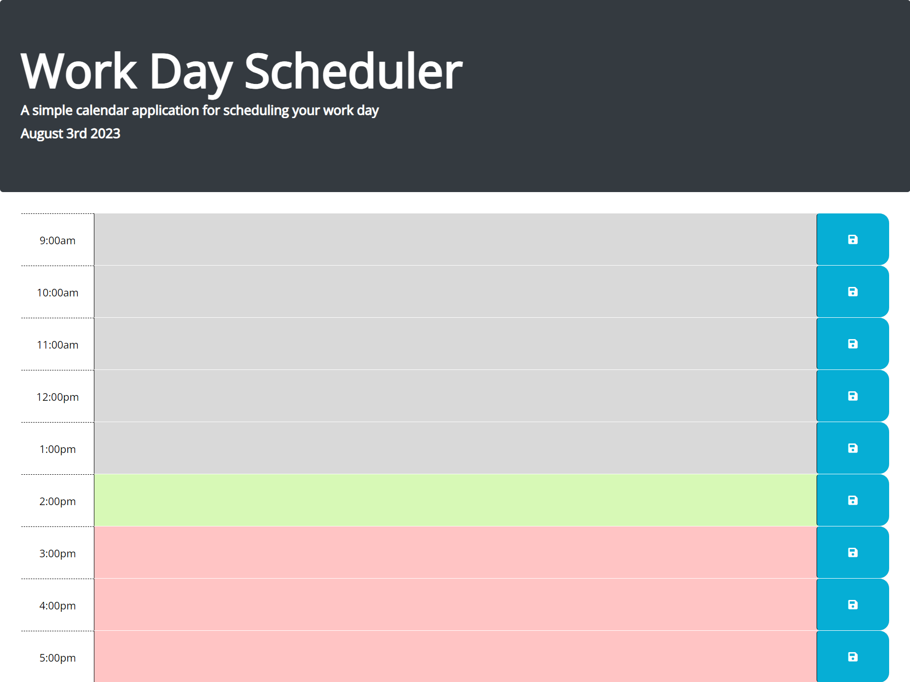

# CalenderApplication

## Project Description 

This project involved creating a simple calendar application that allows a user to save events for each hour of the working day from 9am - 5pm.

Below is a summary of the changes/additions that have been made to the original HTML and Javascript file.

* Hero Header formatting changed to Bootstrap Jumbotron.

* Current Date displayed in the Hero Header

* Colour Coded Timeblocks which represent the relative time in the day: past (grey), present (green), red(future).

* Upon click of the time-block a user can enter their task.

* Upon click of the save button, the task is saved into the local storage. 

* Upon refresh, the saved events persist. 

# Usage

1. In order to run the application, click on the deployed application link.

2. Once you have been redirected to the web-page, click in the text area of a specific work hour and enter your task. Click save for the task to be saved in local storage.

# Website Preview

# Links
[Click here to access the deployed website.](https://fadumaabdi.github.io/CalenderApplication/)

[Click here to access the files on the github repository.](https://github.com/fadumaabdi/CalenderApplication)

